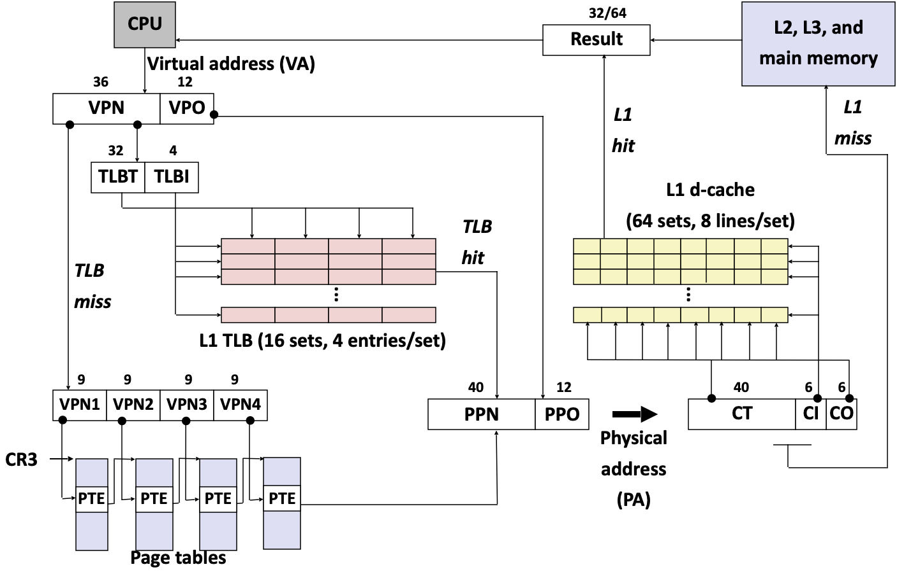
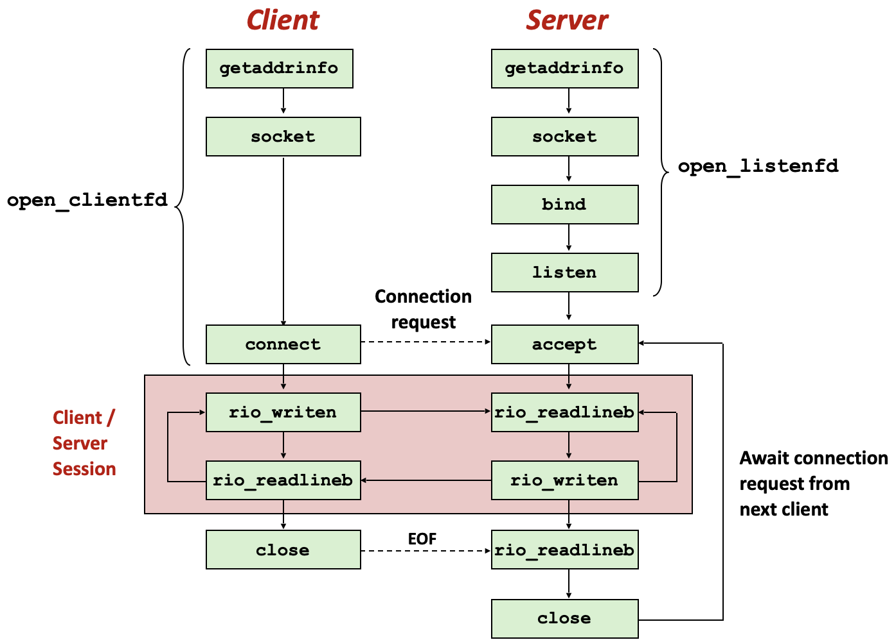

# **Summary**

这门被神化了的课主要从编程者的角度介绍了计算机硬件及系统。可谓大而全：

1. 信息在硬件层面的二进制表示
2. 汇编语言（二进制机器语言的文字表示）：机器级编程
	- 寄存器、控制、栈、过程（subroutine/procedure）等
3. 存储的等级制度：缓存、内存、硬盘、网络
4. 硬件和系统层面的控制流
5. 虚拟内存
6. 动态内存分配（堆）
7. 网络：并发、线程、同步（线程/进程）

这些内容对于计算机硬件的了解非常有效，而且对于编程的帮助也很大，但是大量内容介于底层操作和顶层概念之间这种不上不下的状态使得过程非常无聊。

几个lab还算有趣：

1. datalab：整数和浮点数位元层级操作
2. bomblab：汇编语言的熟悉
3. attacklab：栈运行机制的了解
4. cachelab：缓存机制的了解和优化（Blocking）

其中cachelab是写的第一个C语言程序，而且比较接近算法问题，还挺享受的。当然也有一些如小学生智力问答一般的问题。
后边的几个lab

5. shellab：硬件和系统层面的控制流
6. malloclab：动态内存管理
7. proxylab：网络代理

涉及大量的库调用和系统调用，非常无聊，参考了书本快速做掉，作为对于硬件和系统层面的控制流、动态内存管理、网络的了解，未来有需要的时候再花更多时间完成。

两个教授讲得比较枯燥，或许内容是好的。教材讲解的很清楚，配合lab来看还不错。

总之内容不错，但是课程的安排应该不算很有趣，让我想起MIT 2010年6.042中Dr. Marten van Dijk上的几节课。

### Constructive Concepts

- 计算机中的数据只是大量的bits，通过不同的解读方式类比计算机以外世界中的概念（整数、实数、文字等等）
	- 由于是大量的bits，因此适合逻辑运算
- 程序最终会被转化为机器代码来运行，用高级语言编写的程序也不过是机器代码的各种各样的映射；很多操作也只是对计算机以外世界中的操作的类比
	- 那么，计算机本身想做什么（Stephen Wolfram）
- Caching的机制，以此来处理存储性能的物理限制
	- Virtual Memory也是实现Caching的一个方式

# <u>Unit1. Representing and Manipulating Information</u>

- Bit-level manipulations
- Integers
	- signed/unsigned
	- Conversion/Casting
	- Expanding/Truncating
	- Arithmetic (Overflow)
		- Addition
		- Multiplication
		- Power-of-2 Division/Multiplication with Shift
- Byte Ordering
	- Big Endian
		- Network
	- Little Endian (reversed)
- Floating Point
	- IEEE Standard
- **<u>int is not integer / floating point is not real number</u>**

# <u>Unit2. Machine-Level Representation of Programs</u>

- Register

	- Integer Registers
	- Program Counter
	- Condition Code Registers
	- Floating-Point Registers

- Operand

- Operation

	- Data Assembly-code Suffix
		-  ​	
	- `move`
	- `lea` (Load Effective Address)
	- `jump`
		- Conditional Moves
		- Condition: `if` / `switch`
		- Loop: `for` / `while`

- Procedure

	- Stack Structure
		- Stack Frame / Stack Pointer
	- `call` / `ret`
	- LInux Register Usage
		- Return Value / Arguments / Caller-saved / Callee-saved / Stack Pointer / Frame Pointer

- Data

	- Array
	- Structure
		- Alignment
	- Union

- Buffer Overflow

	- Code Injection Attack
	- Return-oriented Programming Attack

	

# <u>Unit3. The Memory Hierarchy</u>

- Locality
	- Foundation of Caching
	- Temporal Locality
	- Spatial Locality
- Cache
	- Fundamental idea of Memory Hierarchy
	- Cache Misses
		- Cold miss
		- Confilict miss
		- Capacity miss
- Cache Memory Organization
	- Sets
		- Lines
			- Valid Bit, Tag, Block
- Address of word
	- Tag, Set Index, Block Offset
- Performance Impact
	- The Memory Mountain
		- Read throughput: Number of bytes read from memory per second (MB/s)
		- Affected by Stride(数据间隔) and Size(数据大小)
	- Make the common case go fast
		- Focus on the most inner loops of the core functions
			- Rearranging loops to improve spatial locality
			- Using blocking to improve temporal locality

# <u>Unit4. Exceptional Control Flow</u>

- ECF type
	- Exceptions
		- OS and hardware
	- Process context switch
		- OS and hardware timer
	- Signals
		- OS
	- Nonlocal jumps
		- C runtime library
- Details refer to Diagram Graph

# <u>Unit5. Virtual Memory</u>

- VM as a tool for caching
	- Conceptually, virtual memory is an array on disk that is cached in physical memory
		- These cache blocks are called pages
	- DRAM Cache Organization: enormous miss penalty
		- Large page (block) size: typically 4 KB, sometimes 4 MB
		- Fully associative 
		- Highly sophisticated, expensive replacement algorithms
		- Write-back rather than write-through
- Address translation
	-  ​	
- Memory Mapping
	- Save head-on operation
	- Private Copy-on-write(COW)

# <u>Unit6. Dynamic Memory Allocation</u>

- Performance Goal
	- Throughput
	- Peak Memory Utilization
		- Fragmentation
			- internal fragmentation
			- external fragmentation
- Keeping Track of Free Blocks
	- Method 1: Implicit list using length—links all blocks
	- Method 2: Explicit list among the free blocks using pointers
	- Method 3: Segregated free list
	- Method 4: Blocks sorted by size
- Key Operations
	- Finding a Free Block
	- Allocating in a free block
		- Splitting
	- Freeing a Block
		- Coalescing
- Garbage collection
	- Memory as a Graph
	- Mark and Sweep Collecting

# <u>Unit7. Network Programming</u>

- Network as an I/O device
- internet Protocol
	- IP (Internet Protocol)
	- UDP (Unreliable Datagram Protocol)
	- TCP (Transmission Control Protocol)
- Internet
	- IP Addresses
	- Domain Naming System (DNS)
	- Internet Connections
		- A socket is an endpoint of a connection `IPaddress:port` 
		- A port is a 16-bit integer that identifies a process
- Sockets Interface
	-  ​	
- Web Server Basics
	- HTTP (HyperText Transfer Protocol)
	- Static and Dynamic Content
	- URL (Universal Resource Locator)
- Concurrency
	- Threads vs. Processes
	- Approaches to Concurrency
		- Process
		- Event
		- Thread
- Synchronizing Threads
	- Using Semaphores for Mutual Exclusion

