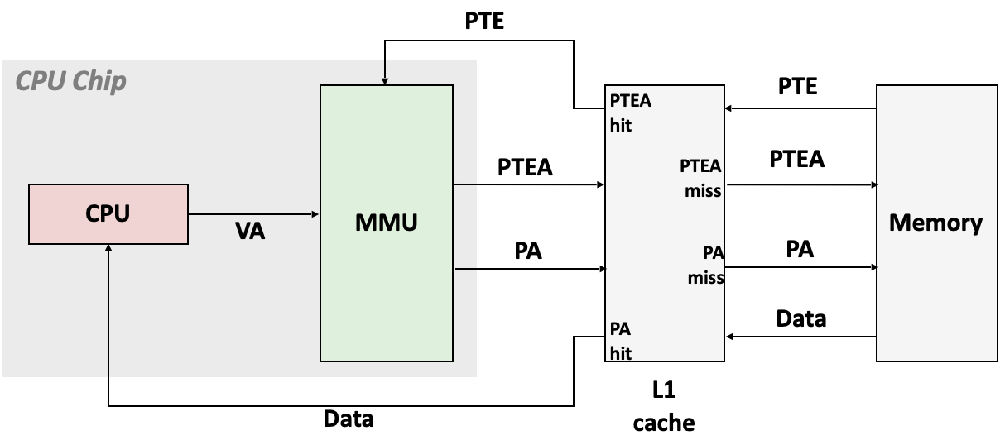
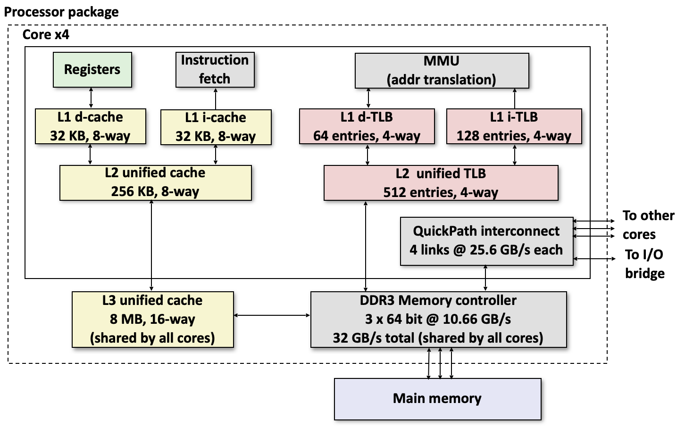

# <u>L17. Virtual Memory: Concepts</u>

## VM as a tool for caching

- Conceptually, virtual memory is an array of N contiguous bytes stored on disk.
- The contents of the array on disk are cached in physical memory (DRAM cache)
	- These cache blocks are called pages (size is P = 2^p bytes)

### DRAM Cache Organization

- DRAM cache organization driven by the enormous miss penalty
	- Large page (block) size: typically 4 KB, sometimes 4 MB
	- Fully associative 
		- Any VP can be placed in any PP
		- Requires a “large” mapping function – different from cache memories
	- Highly sophisticated, expensive replacement algorithms
		- Too complicated and open-ended to be implemented in hardware
	- Write-back rather than write-through

## VM as a tool for memory management

- Simplifying memory allocation

	- Each virtual page can be mapped to any physical page
	- A virtual page can be stored in different physical pages at different times

- Sharing code and data among processes

	- Map virtual pages to the same physical page (here: PP 6)

## VM as a tool for memory protection

## Address translation

### Symbols

- Basic Parameters
	- N = 2^n : Number of addresses in virtual address space
	- M = 2^m : Number of addresses in physical address space
	- P = 2^p  : Page size (bytes)
- MMU: Memory Management Unit
- Components of the virtual address (VA)
	- PTE: Page table entry
	- PTEA: PTE Address
	- TLB: Translation Lookaside Buffer
	- TLBI: TLB index
	- TLBT: TLB tag
	- VPO: Virtual page offset 
	- VPN: Virtual page number 
- Components of the physical address (PA)
	- PA: Physical Address
	- PPO: Physical page offset (same as VPO)
	- PPN: Physical page number

### Integrating VM and Cache

### Speeding up Translation with a TLB

### Multi-Level Page Tables

- **Suppose:**

- - 4KB (212) page size, 48-bit address space, 8-byte PTE 

- **Problem:**

- - Would need a 512 GB page table!

	- - 248 * 2-12 * 23 = 239 bytes

# <u>L18. Virtual Memory: Systems</u>

## Case study: Core i7/Linux memory system

### Intel Core i7 Memory System

### End-to-end Core i7 Address Translation

## Memory Mapping

### Private Copy-on-write(COW)

### fork / execve Revisited

## *Thinking*

这两讲介绍了Virtual Memory（虚拟内存），一个之前经常提到的概念，也是Parallelism的基础。一个重要的类比就是把Virtual Memory当作存储在disk上，而Physical Memory是它的Cache。但由于这个Cache Miss的代价太大，因此其设计的原则是尽量减少Miss的可能，因此有很大的block size，而且是fully associative。

自此我们了解了在实际从cache（i7中分三层）到memory到disk查找数据之前，Address Translation的完整路径：

- 寻找虚拟地址（VA）对应的物理地址（PA）
	- 首先CPU发送一个VA
	- 看是否在MMU的TLB（i7中分两层）中
	- 不在的话在Physical Memory的Page Table中查找
- 通过PA查找数据
	- 首先在Cache中查找，Cache是多层级的partly associative的SRam
	- 不在的话在Memory中查找，并复制到Cache中，Memory是一个fully associative的DRam
	- 不在的话从Disk复制到Memory中
- 最后将结果从Cache返回到CPU

